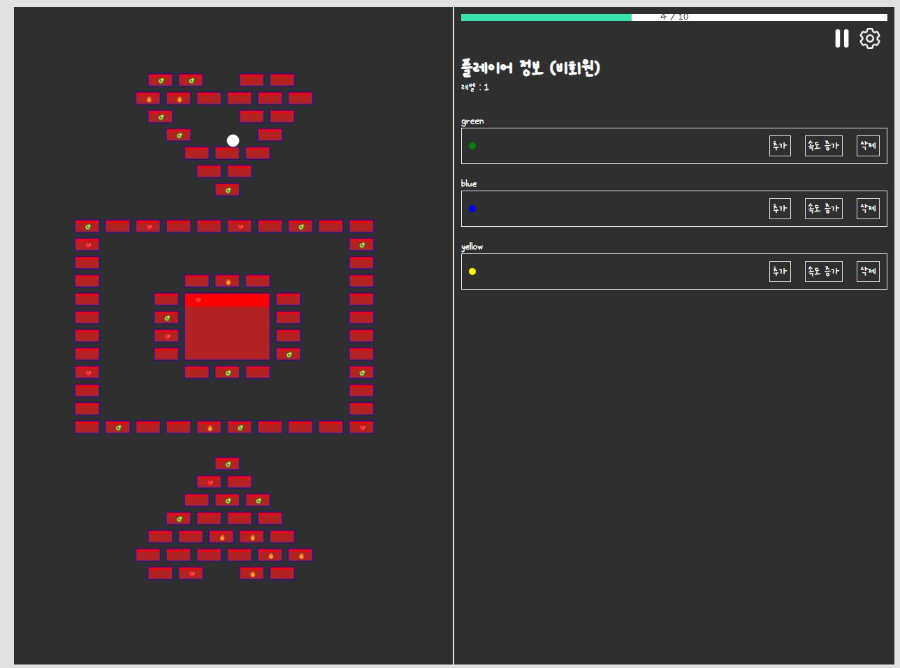

<h2> brickbreaker <a href='https://pukkok.github.io/brickbreaker'>[게임하러가기]</a></h2>

## 게임 방법
1. 로그인 해도 되고 안해도 됩니다.
2. 로그인 시 저장 가능합니다.
3. 추가버튼으로 공 개수 늘리기
4. 공 속도 증가 버튼으로 공 속도 늘리기
5. 제거 버튼으로 공 삭제 기능
6. 유저 볼 레벨업 하기

## 오류 발생 시
1. 제작 단계입니다. 아직 구현이 안되었을 가능성이 높습니다.
2. 1280px 기준 게임 화면입니다. 웹 전용 게임입니다.

## 이후 제작할 내용
1. 공 속도, 공의 데미지 표기
2. 유저 볼 레벨업시 능력치 변화
3. 벽돌 부술때마다 아이템, 골드 생성
4. ...

## 제작 사유
1. 캔버스 연습용으로 제작 
2. 자바스크립트를 기준으로 구현하기
